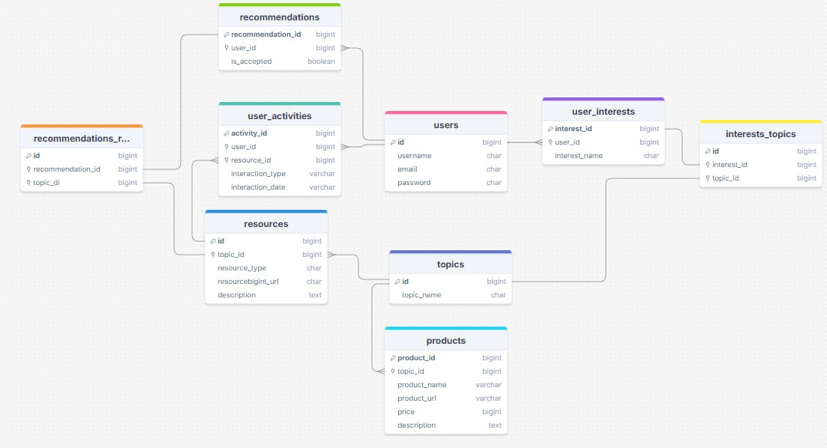

Задача следующая:
Составить архитектуру базы данных для эффективной работы электронного помощника (допустим в телеграм или на
веб-платформе)

Принцип работы помощника следующий:
клиент обращается к помощнику для обогащения своих знаний в какой-либо сфере
(можешь дать волю воображению, это может быть как финансовый, так и спортивный, развлекательный помощник или помощник в
сфере иностранных языков)

Помощник, по выбранной клиентом теме для изучения, перенаправляет клиента на статьи, сайты, базы знаний или магазины с
определенным оборудованием или книгами, а также продвигает релевантные для клиента товары, изучает и запоминает сферы
его интересов.

Что нужно предложить:
какие таблицы в БД необходимы для хранения всей необходимой информации для эффективной работы помощника?
Это может быть как концептуальная, так и физическая модель БД, т.е. таблицы можно оформить в любом удобном для тебя
смысловом виде, желательно указать связи между данными в таблицах тоже (primary и foreign key).

ВЫПОЛНЕННОЕ ТЗ:

1. users
   хранит информацию о клиентах, которые пользуются помощником.

2. user_interests
   хранит информацию о темах, которые интересуют пользователей

3. topics
   хранит темы, которые помощник предлагает пользователям для изучения

4. resources
   хранит ссылки на статьи, книги, магазины или базы данных, которые связаны с определёнными темами

5. user_activities
   хранит историю взаимодействия пользователя с помощником

6. products
   хранит информацию о продуктах которые могут быть быть рекомендованы

7. recommendations
   хранит информацию о рекомендациях, которые отправлялись пользователю, ссылка на ресурс и как пользователь
   отреагировал на него

Где связи многие ко многим - созданы связные таблицы, например, interests_topics

Ключик - primary key
Замочек - foreign key

